# Roteiro de demonstração — AP2

Sequência para a demonstração prática, com as capturas de cada passo já
executado. Duração alvo: **7 minutos**.

As imagens são capturas reais dos comandos rodando nesta máquina, e servem para
dois propósitos: ensaiar a apresentação sabendo exatamente o que vai aparecer na
tela, e servir de prova caso algo falhe no dia.

---

## Antes de começar

Dois terminais abertos na pasta `Atividade_Prática_II`, com o ambiente virtual
ativado nos dois:

| Terminal | Papel |
| --- | --- |
| **A** | Servidor. Fica rodando e mostrando o log estruturado |
| **B** | Cliente. É onde os comandos da demonstração são digitados |

Confira antes de apresentar:

- [ ] `pip install -r requirements.txt` já executado
- [ ] Porta 8000 livre
- [ ] `python seed.py` roda sem erro
- [ ] Os cinco scripts em `demo/` executam

> **Ordem importa.** `seed.py` precisa rodar **antes** de subir o servidor. A API
> carrega o estado do arquivo na inicialização, então semear com o servidor no ar
> não teria efeito sobre o processo em execução.

---

## Passo 1 — Estado inicial (30 s)

**Terminal B:**

```bash
python seed.py
```

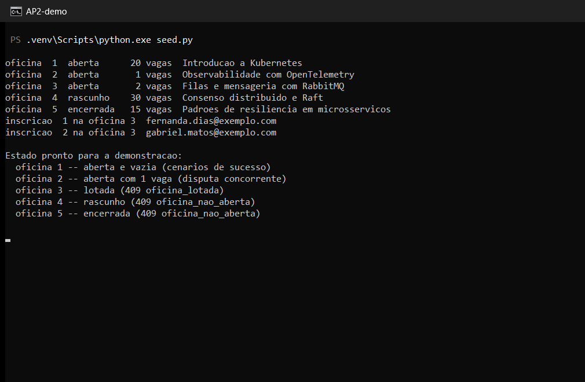

**O que dizer:** as cinco oficinas cobrem os estados que a demonstração precisa.
A de vaga única é onde os clientes concorrentes vão disputar; a lotada e a em
rascunho produzem conflitos de naturezas diferentes.

---

## Passo 2 — Suíte automatizada (30 s)

**Terminal B:**

```bash
python -m pytest -p no:warnings
```

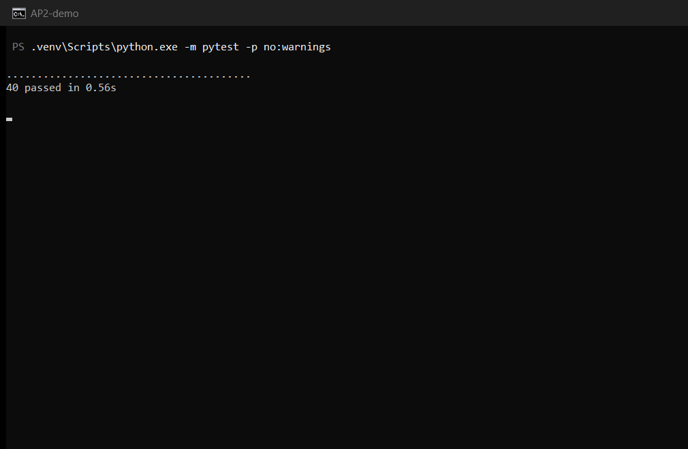

**O que dizer:** 40 testes cobrindo contrato e invariantes. Dois deles testam
concorrência — e foram verificados desabilitando o lock do repositório, o que os
faz falhar. Eles não passam por acaso.

---

## Passo 3 — Servidor no ar (20 s)

**Terminal A:**

```bash
python -m uvicorn app.main:app --host 127.0.0.1 --port 8000
```

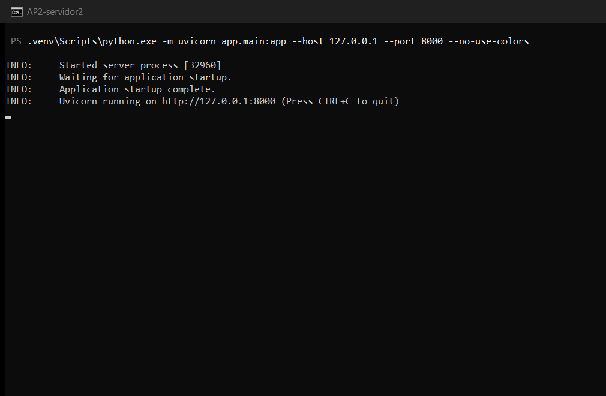

Deixe este terminal visível: a partir daqui ele mostra uma linha de log por
requisição.

> Se preferir `fastapi dev app/main.py` e ele falhar com `UnicodeEncodeError`, é
> o banner colorido da CLI contra o console em cp1252 — use o `uvicorn` acima.

---

## Passo 4 — Criação de recurso (45 s)

**Terminal B:**

```bash
.\demo\01-criar-oficina.ps1
```

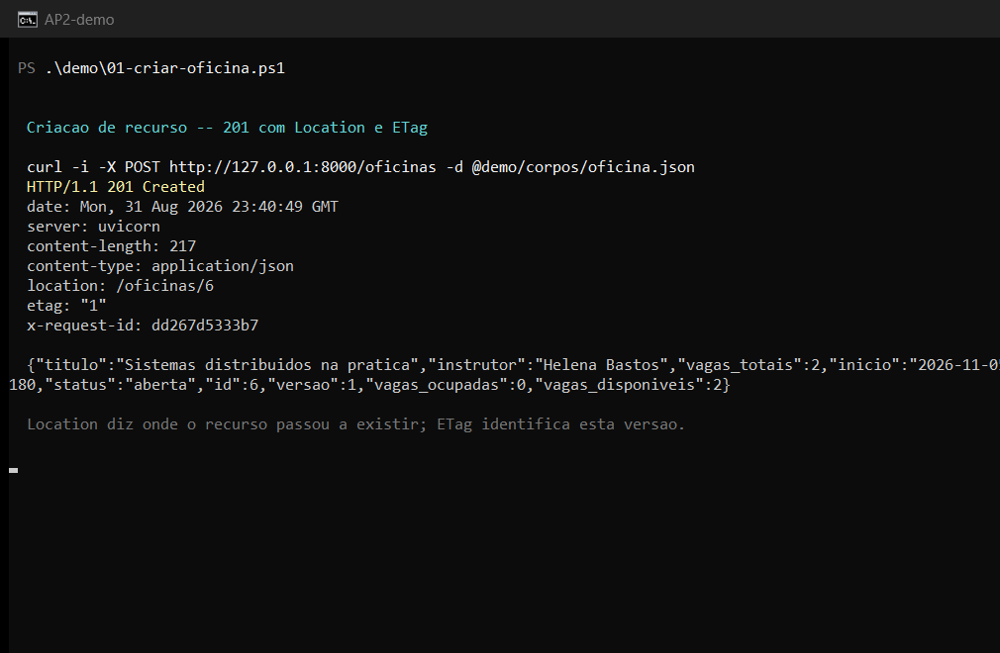

**O que dizer:** três coisas na resposta. O **201** informa criação; o
**`location`** diz onde o recurso passou a existir, para o cliente não precisar
montar a URI a partir do corpo; e o **`etag`** identifica esta versão, que é o
que torna possível detectar escrita concorrente depois.

Repare também em `vagas_ocupadas` e `vagas_disponiveis`: são calculados pelo
servidor, não armazenados. Não existe contador para dessincronizar da lista.

---

## Passo 5 — Conflito por unicidade (45 s)

**Terminal B:**

```bash
.\demo\02-inscricao-duplicada.ps1
```

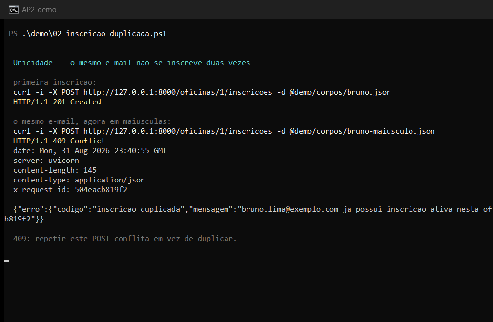

**O que dizer:** a primeira inscrição é aceita; a segunda, com o mesmo e-mail em
maiúsculas, recebe **409**. O e-mail é normalizado antes da comparação, senão
bastaria trocar a caixa para furar a regra.

Este é o momento de mencionar o contraste: repetir `POST /oficinas` cria um
segundo recurso, repetir este `POST` conflita. Nenhum dos dois é idempotente — a
diferença é que aqui existe um invariante de unicidade que o servidor protege.

---

## Passo 6 — Conflito por capacidade (30 s)

**Terminal B:**

```bash
.\demo\03-oficina-lotada.ps1
```

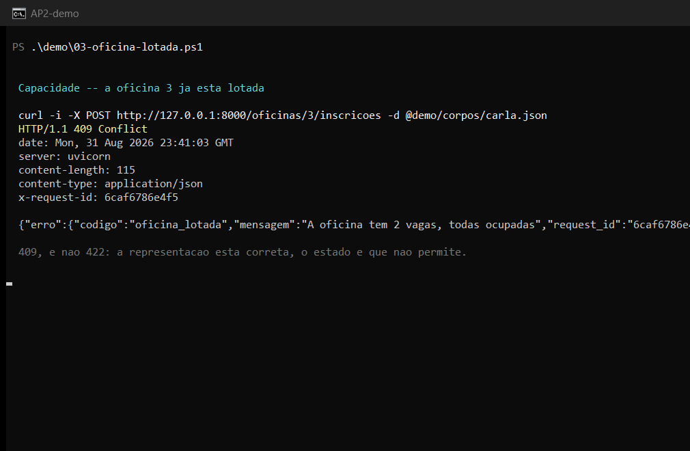

**O que dizer:** **409 e não 422**. A representação enviada está perfeita; o que
impede é o estado do servidor. A mesma requisição teria sido aceita antes da
última vaga acabar. É a distinção que mais se erra em API REST.

---

## Passo 7 — Concorrência com ETag (60 s)

**Terminal B:**

```bash
.\demo\04-precondicao.ps1
```

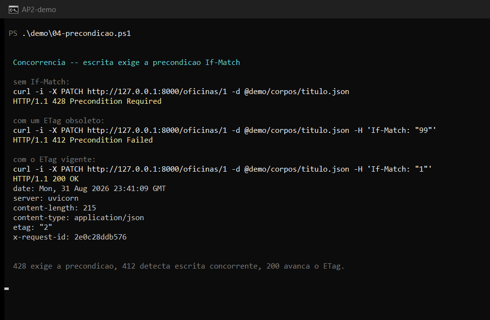

**O que dizer:** os três casos em sequência.

- **428** — a escrita não trouxe `If-Match`. A precondição é exigida, não
  opcional: se fosse opcional, quem não a enviasse continuaria capaz de causar
  a perda que o mecanismo existe para impedir.
- **412** — trouxe um ETag que não corresponde à versão atual. Houve escrita
  concorrente.
- **200** — com o ETag vigente. Note o `etag` da resposta virar `"2"`: a versão
  avançou, e o `"1"` que outro cliente ainda tenha em mãos já não vale.

---

## Passo 8 — Indisponibilidade com resposta (40 s)

**Terminal B:**

```bash
.\demo\05-manutencao.ps1
```

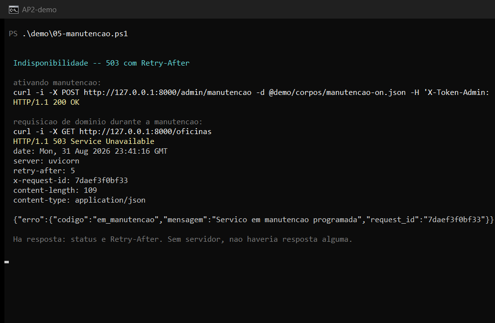

**O que dizer:** **503 acompanhado de `retry-after: 5`**. O cliente sabe que o
serviço existe, está indisponível, e quando tentar de novo. Guarde este quadro:
o passo 12 mostra o contraste.

---

## Passo 9 — Timeout do cliente (40 s)

**Terminal B:**

```bash
python demo_timeout.py
```

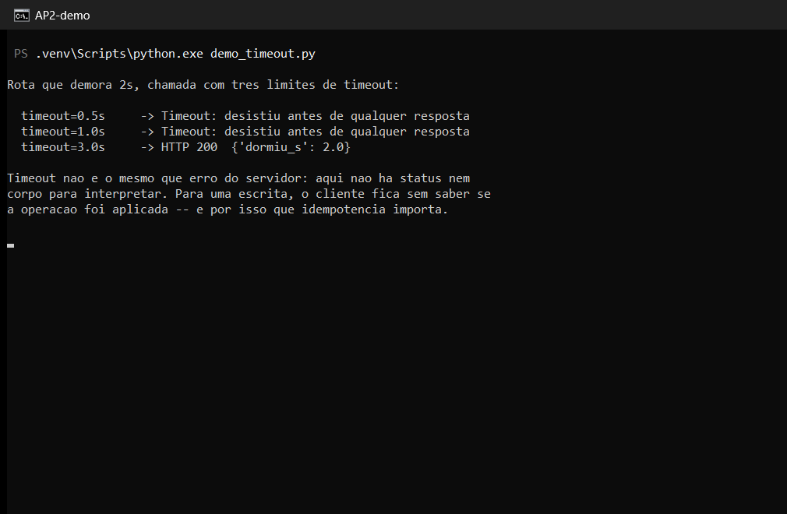

**O que dizer:** os dois primeiros expiram, o terceiro completa. O ponto não é
que o timeout funciona — é o que o cliente **não** sabe quando ele estoura: se o
servidor executou a operação ou não. Para leitura isso é irrelevante; para
escrita é o motivo pelo qual idempotência importa.

---

## Passo 10 — Tabela de evidências (45 s)

**Terminal B:**

```bash
python cliente_testes.py
```

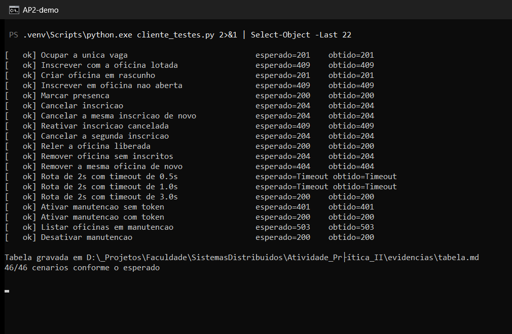

**O que dizer:** 46 cenários executados contra o servidor real, e a tabela
entregável é **gerada** por esta execução. Uma tabela escrita à mão descreve o
que se acredita que a API faz; esta descreve o que ela fez.

---

## Passo 11 — Concorrência real (60 s)

**Terminal B:**

```bash
python cliente_concorrente.py
```

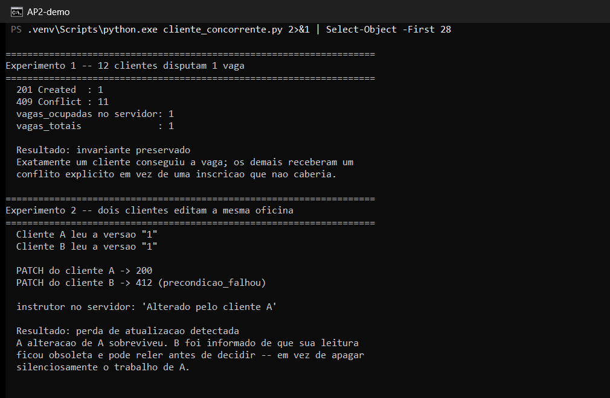

**O que dizer** — este é o passo mais forte da apresentação, com dois
experimentos:

**Doze clientes, uma vaga.** Exatamente um 201 e onze 409, e o servidor termina
com `vagas_ocupadas = 1`. Sem exclusão mútua, vários passariam pela verificação
de capacidade antes que qualquer um gravasse.

**Dois clientes editando.** Ambos leem a versão `"1"`. O primeiro grava com 200,
o segundo recebe 412. A alteração do primeiro sobreviveu, e o segundo foi
informado em vez de apagar o trabalho dele silenciosamente.

---

## Passo 12 — Falha de conectividade (40 s)

Encerre o servidor no **terminal A** com `Ctrl+C`, e no **terminal B**:

```bash
python cliente_testes.py --offline
```

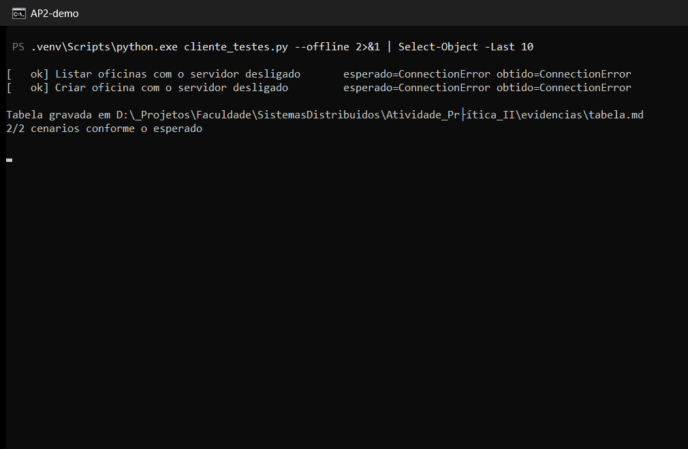

**O que dizer:** compare com o passo 8. Lá havia **503**: status, corpo e
`Retry-After`. Aqui há **`ConnectionError`**: nenhuma resposta, nada para
interpretar. Tratar os dois como "o serviço caiu" apaga a diferença — no primeiro
caso existe um servidor vivo que escolheu recusar e disse quando voltar.

---

## Passo 13 — Observabilidade (30 s)

**Terminal B:**

```bash
Get-Content evidencias\servidor.log -Tail 12 | ConvertFrom-Json | Select-Object request_id, metodo, caminho, status, duracao_ms | Format-Table
```

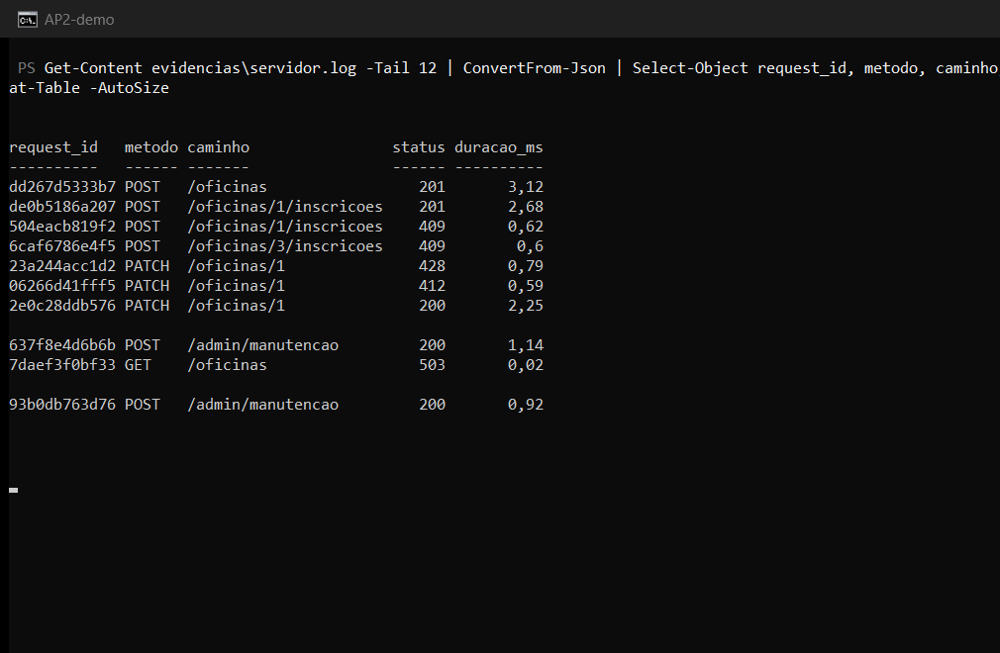

**O que dizer:** a demonstração inteira aparece aqui — 201, 409, 428, 412, 200,
503 — cada requisição com identificador de correlação e duração. O `request_id`
é o mesmo que volta no corpo do erro, ligando o que o cliente viu à linha do
servidor. Nenhum token é registrado.

---

## Se algo der errado

| Sintoma | Causa provável | Saída |
| --- | --- | --- |
| `ConnectionError` fora do passo 12 | Servidor não está no ar | Suba o terminal A |
| `409` inesperado no passo 4 ou 5 | Estado sujo de um ensaio anterior | `python seed.py` e reinicie o servidor |
| `412` onde se esperava `200` | O ETag mudou desde o ensaio | `curl -i http://127.0.0.1:8000/oficinas/1` e use o ETag atual |
| Porta 8000 ocupada | Servidor anterior não encerrado | Encerre o processo, ou use `--port 8001` |
| `UnicodeEncodeError` ao subir | Banner da CLI do FastAPI em cp1252 | Use `python -m uvicorn ...` |

Se o ao vivo falhar, as capturas deste documento são a evidência da execução —
e `evidencias/tabela.md` traz os 48 cenários com status esperado e obtido.

---

## Cobertura do checklist da especificação

| Item do checklist | Passo |
| --- | --- |
| A API inicia a partir das instruções do README | 3 |
| Todos os endpoints obrigatórios foram testados | 2 e 10 |
| Evidências de pelo menos três cenários de erro | 5, 6, 7, 8 e 12 |
| Timeouts são definidos no cliente | 9 |
| Os resultados foram analisados, não apenas capturados | 11 e 12, com `docs/analise.md` |

---

## Como estas capturas foram feitas

Os cinco scripts em `demo/` executam os passos de HTTP e imprimem o comando em
forma legível antes de rodá-lo. Eles são reprodutíveis: qualquer pessoa com o
repositório e o servidor no ar obtém as mesmas respostas.
